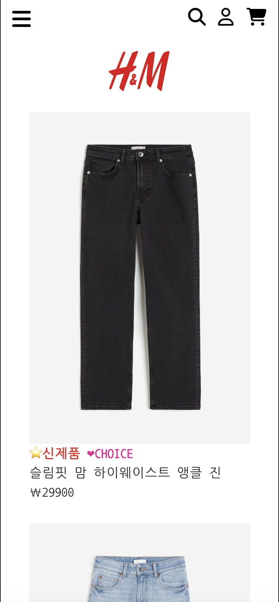

## H&M 웹사이트 클론 코딩

### 배포 사이트

👉🏻👉🏻 [H&M 웹사이트]("https://bright-paprenjak-05cf2c.netlify.app")


<p align="center"></p>

모바일 버전에서는 메뉴를 상단바에서 노출이 되도록 변경하였고, 모바일 버전에 맞게 이모티콘으로 최대한 표시할 수 있도록 표시를 바꾸었다.
또한, 이미지의 크기도 브라우저 버전과 모바일 버전에 맞게 재조정하였다.

### 📌 기간
---
2024.03.27 ~ 2024.04.03 

### 📌 Description && Code
---

✔ productAction
```
  
 let url = `https://my-json-server.typicode.com/82everywin/react_hnm_practice/products?q=${searchQuery}`;
 let response = await fetch(url);
 let data = await response.json();
```
my-json-server 로 json-server 를 구축해 접근할 수 있도록 변경하였다.

✔ PrivateRoute
```
const PrivateRoute = ({isMobile}) => {

  const authenticate = useSelector((state)=> state.auth.authenticate);

  return (
   authenticate==true? <ProductDetail isMobile={isMobile}/>: <Navigate to="/login"/>
  )
}

export default PrivateRoute
```
Route

로그인 여부로 상세페이지와 로그인페이지로 나누었다. 


✔ store
```
import {createStore, applyMiddleware} from "redux"
import {thunk} from 'redux-thunk';
import rootReducer from './reducer' // 이렇게 해줘서 자동으로 index.js를 읽음 
import { composeWithDevTools } from '@redux-devtools/extension';


let store = createStore(rootReducer,composeWithDevTools(applyMiddleware(thunk)))

export default store
```
✔ productreducer
```
let initialState = {
    productList:[],
    product :[]
    
}

function productreducer(state=initialState,action){

    switch (action.type){
        case   "GET_PRODUCT_SUCCESS":
            return {...state, productList : action.payload.data };
        case "GET_PRODUCT_DETAIL_SUCCESS":
            return {...state,product : action.payload.data}
        default : 
        return {...state};
    }

}

export default productreducer
```
✔ authenticateReducer
```

let initialState = {
    id:'',
    pw:'',
    authenticate: false
};

function authenticateReducer(state=initialState,action){
    let {type,payload} = action
    switch(type){
        case "LOGIN_SUCCESS":
            console.log("login success reducer")
            return {...state,id:payload.id, pw:payload.pw,authenticate:true};
        case "AUTHENTICATE":
            return {...state, authenticate: !(state.authenticate)};
        default :
            return {...state};
    }

}

export default authenticateReducer
```
Redux로 단방향을 처리하였고, 리덕스 미들웨어 중 'Redux-thunk' 를 사용해 비동기방식을 해결하였다. 
( 기술설명은 블로그로 기술하고, 추후에 추가 기록 예정..)

✔ ProductAll
```
onst getProducts = async() => {
        let searchQuery = query.get('q') || "";
        dispatch(productAction.getProducts(searchQuery))
    }
```
dispatch로 바로 저장소(store)로 보내는 것이 아니라, 미들웨어로 전송되도록 하였다. 
✔ productAction
```
// middleware 함수가 들어가는 자리 


function getProducts(searchQuery) {
    return async(dispatch, getState) => {
        
        let url = `https://my-json-server.typicode.com/82everywin/react_hnm_practice/products?q=${searchQuery}`;
        let response = await fetch(url);
        let data = await response.json();
        console.log(data)
        dispatch({type:"GET_PRODUCT_SUCCESS", payload:{data}})
    }
}

function getProductsDetail(id){
    return async(dispatch, getState)=>{
    let url = `https://my-json-server.typicode.com/82everywin/react_hnm_practice/products/${id} `;
    let response = await fetch(url)
    let data = await response.json();
   // console.log(data);
    dispatch({type:"GET_PRODUCT_DETAIL_SUCCESS", payload:{data}})
    }
}


export const productAction={getProducts, getProductsDetail}
```
비동기 처리를 해야하는 부분 즉 API호출을 할 경우에는 리덕스 미들웨어를 통해 dispatch 하는 방식을 사용했다. 

✔ redux/index.js
```
import { combineReducers } from "redux";
import authenticateReducer from "./authenticateReducer";
import productreducer from "./productreducer";


export default combineReducers({

    auth : authenticateReducer,
    product : productreducer
})
```
Reducer는 로그인 인증, API호출 목적에 따라 나누어 파일을 생성하였으므로, 'combineReducers'를 사용하여 묶어주었다.
